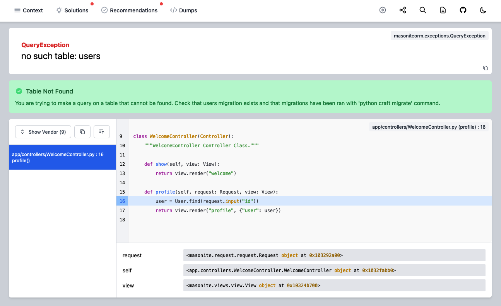
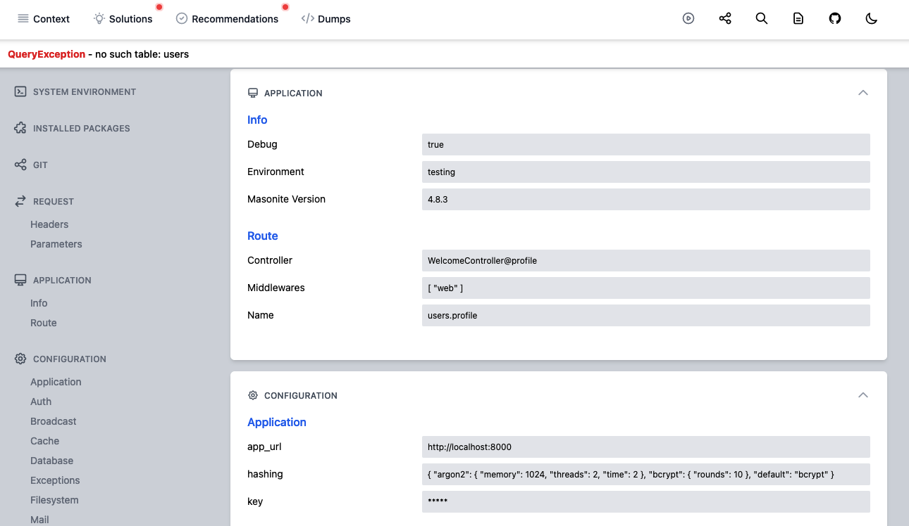
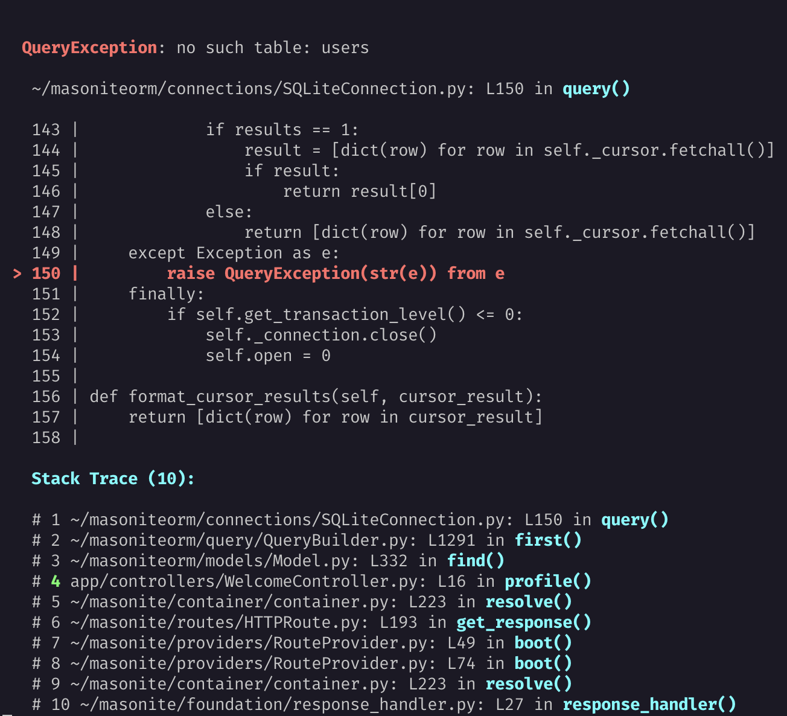
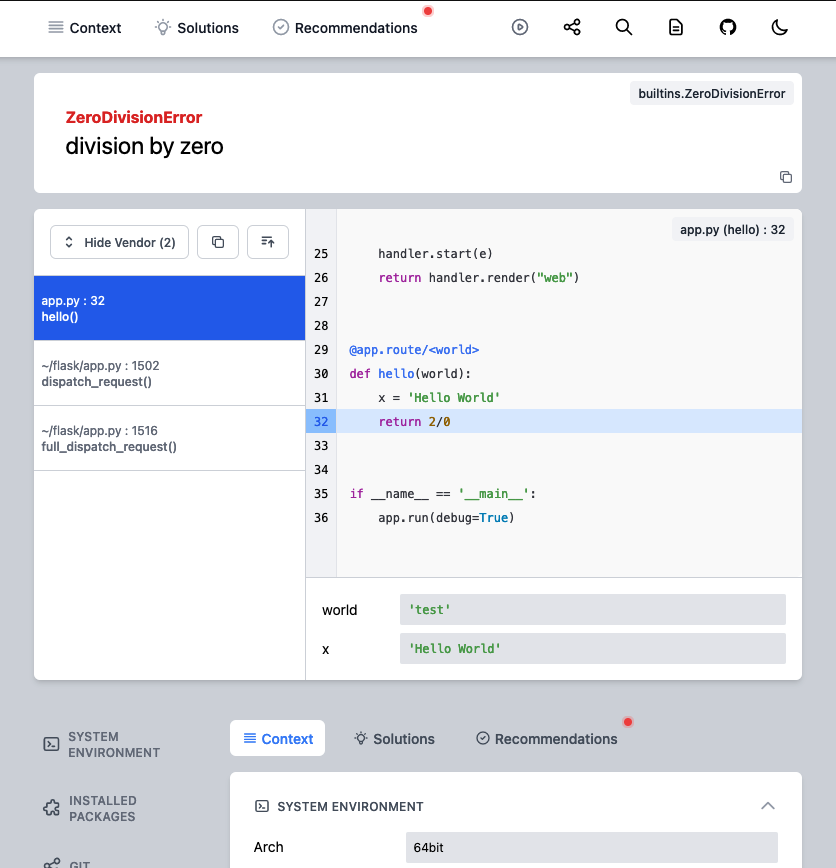
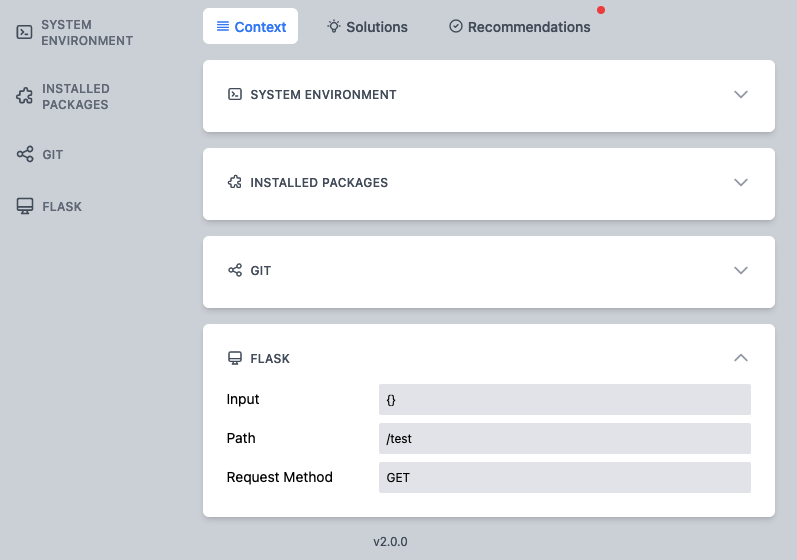

# Exceptionite

<p align="center">
  <a href="https://docs.masoniteproject.com">
    
  </a>
  
  
  
  
  <a href="https://github.com/psf/black"></a>
</p>

A Python exception library designed to make handling and displaying exceptions a cinch.

Exceptions can be rendered into a beautiful HTML exception page!




or in your terminal:




# Getting Started

First install the package:

```bash
pip install exceptionite
```

Then you can follow instruction for your use case:

- [Masonite](#usage-for-masonite)
- [Flask](#usage-for-flask)
- [Django](#usage-for-django)
- [Django REST framework](#usage-for-django-rest-framework)
- [Pyramid](#usage-for-pyramid)
- [Basic Python](#usage-for-python)

## Usage for Masonite

Masonite 4 is already using `exceptionite` for its default error page so you don't have anything
to set up.
If you are using `Masonite < 4.0`, please use `exceptionite < 2.0`.

## Usage for Flask

If you are using `Flask` you can also use this package! Here is an example for a flask application:

```python
from flask import Flask, request
from exceptionite.flask import ExceptioniteReporter

app = Flask(__name__)


@app.errorhandler(Exception)
def handle_exception(exception):
    handler = ExceptioniteReporter(exception, request)
    # display exception stack trace nicely in console
    handler.terminal()
    return handler.html()


@app.route("/<world>")
def hello(world):
    test = "Hello World"
    return 2 / 0


if __name__ == "__main__":
    app.run(debug=True)
```

You'll now see this beautiful exception page:




## Usage for Django

You can customize error reports in Django in `DEBUG` mode as explained in the [docs](https://docs.djangoproject.com/en/3.2/howto/error-reporting/#custom-error-reports).

Install the package if you haven't done so yet

```python
# settings.py
$ pip install exceptionite
```

Then simple set a default exception reporter to the exceptionite one. Be careful this reporter
should only be used for local development with `DEBUG=True`:

```python
# myapp/settings.py
if DEBUG:
    DEFAULT_EXCEPTION_REPORTER = "exceptionite.django.ExceptioniteReporter"
```

If you want Django 404 to be also handled by exceptionite you should add an other reporter:

```python
# myapp/settings.py
if DEBUG:
    # handle 404 errors
    from exceptionite.django import Exceptionite404Reporter

    Exceptionite404Reporter()

    # handle all other errors
    DEFAULT_EXCEPTION_REPORTER = "exceptionite.django.ExceptioniteReporter"
```

## Usage for Django REST framework

You can also customize error reports when using Django REST framework package in `DEBUG` mode as explained in the [docs](https://www.django-rest-framework.org/api-guide/exceptions/).

Install the package if you haven't done so yet

```python
# settings.py
$ pip install exceptionite
```

Then simple set the REST default exception reporter to the exceptionite one:

```python
# myapp/settings.py
if DEBUG:
    REST_FRAMEWORK = {
        "EXCEPTION_HANDLER": "exceptionite.django.drf_exception_handler"
    }
```

Now when doing API requests accepting `application/json` a JSON debug error page
will be returned. When using the Django REST framework browsable API or accessing a GET endpoint from your browser (`text/html`) the HTML exceptionite page will be
displayed !

:warning: Note that this handler will change exception handling behaviour and should be only used when DEBUG mode is enabled.

If you want to customize exception handling for other cases you can do:

```python
# app/exception_handler.py
from exceptionite.django import drf_exception_handler

def custom_handler(exc, context):
    # do what you want here

    response = drf_exception_handler(exc, context)

    # do what you want here
    return response
```

```python
# myapp/settings.py

REST_FRAMEWORK = {
    "EXCEPTION_HANDLER": "myapp.exception_handler.custom_handler"
}
```

## Usage for Pyramid

If you are using `Pyramid` you can also use this package! You just need to register two handlers
function to handle 404 and any other errors.

Here is an example for a simple pyramid application:

```python
from wsgiref.simple_server import make_server
from pyramid.config import Configurator
from pyramid.response import Response
from pyramid.view import exception_view_config, notfound_view_config

from exceptionite import Handler

handler = Handler()


@exception_view_config(Exception)
def handle_all_exceptions(exc, request):
    handler.start(exc)
    handler.render("terminal")
    response = Response(handler.render("web"))
    response.status_int = 500
    return response


@notfound_view_config()
def handle_404(exc, request):
    handler.start(exc)
    handler.render("terminal")
    response = Response(handler.render("web"))
    response.status_int = 404
    return response

def hello_world(request):
    1 / 0
    return Response("Hello World!")


if __name__ == "__main__":
    with Configurator() as config:
        config.add_route("hello", "/")
        config.add_view(hello_world, route_name="hello")
        # this line below is very important to scan our decorated error handlers
        config.scan()
        app = config.make_wsgi_app()
    server = make_server("127.0.0.1", 8000, app)
    server.serve_forever()
```

## Usage for Python

If you are not using a specific framework you can still use this library. You just have to get
an instance of the `Handler` class and use the `start()` method to start handling the exception.

Then you can get useful information easily and also define how you want to render the error. You
can even add your own renderer.

```python
from exceptionite import Handler

try:
    2/0
except Exception as e:
    handler = Handler()
    handler.start(e)
```

Once you have the handler class theres a whole bunch of things we can now do!

### Getting Exception Details

Getting the exception name:

```python
handler.exception() #== ZeroDivisionError
```

Getting the exception message:

```python
handler.message() #== cannot divide by 0
```

Getting the exception namespace:

```python
handler.namespace() #== builtins.ZeroDivisionError
```

### Rendering an HTML page

You can render an elegant exception page by using the `render` method with the [WebRenderer](#renderers):

```python
handler.render("web") #== <html> ... </html>
```

If you have a framework or an application you can swap the exception handler out with this handler
and then call this method.

### Adding Context

Sometimes you will need to add more information to the exception page. This is where contexts come into play. Contexts are the ability to add any information you need to help you debug information.

If you use a framework like Masonite you might want to see information related to your Service Providers. If you use a framework like django you might want to see a list of your installed apps.

On the left side of the page below the stack trace you will find the context menu. Context is organised into blocks.

1. You can register new contexts quickly by supplying a dictionary or a callable providing a dictionary:

```python
import sys

handler.renderer("web").context("System Variables", {"sys argv": sys.argv})
```

2. Or you [can create custom blocks](#block) and add them to the `Context` tab:

```python
import sys
from exceptionite import Block

class SystemVarsBlock(Block):
    id = "system_vars"
    name= "System Variables"

    def build(self):
        return {
           "sys argv": sys.argv
        }

handler.renderer("web").tab("context").add_blocks(SystemVarsBlock)
```

The second method allows to customize the block.

### Hiding Sensitive Data

Exceptionite is configured by default to scrub data displayed in tab and blocks. This allows hiding sensitive data, by replacing it with `*****`.

Hiding sensitive data can be disabled globally in handler options with `options.hide_sensitive_data`.

It can also be disabled per block by setting `disable_scrubbing = True` in [block class](#block).

The keywords defined to find sensitive data can be edited:

```python
# define a new set of keywords
handler.set_scrub_keywords(["app_secret", "pwd"])
# add new keywords
handler.add_scrub_keywords(["app_secret", "pwd"])
```

You can see the default keywords by accessing `handler.scrub_keywords`.


# Configuration

## Options

The `exceptionite` handler comes with the default options below:
```python
{
    "options": {
        "editor": "vscode",
        "search_url": "https://www.google.com/search?q=",
        "links": {
            "doc": "https://docs.masoniteproject.com",
            "repo": "https://github.com/MasoniteFramework/masonite",
        },
        "stack": {"offset": 8, "shorten": True},
        "hide_sensitive_data": True
    },
    "handlers": {
        "context": True,
        "solutions": {"stackoverflow": False, "possible_solutions": True},
        "recommendations": {"packages_updates": {"list": ["exceptionite"]}},
    },
}
```

You can configure it by using `set_options(options)` method:
```python
from exceptionite import Handler, DefaultOptions

handler = Handler()
options = DefaultOptions
options.get("options").update({"search_url": "https://duckduckgo.com/?q="})
handler.set_options(options)
```

For Masonite, options are defined in `exceptions.py` configuration file.

## Renderers

When an error is caught by Exceptionite, it can be rendered in many ways through configured renderers. Available renderers are:
- WebRenderer: renders the exception as a beautiful HTML error page
- TerminalRenderer: renders the exception nicely in the console
- JSONRenderer: renders the exception as a JSON payload (useful for API errors handling)

A renderer is a simple Python class with `build()` and `render()` methods. Feel free to create
your own one if needed !
```python
class CustomRenderer:
    def __init__(self, handler: "Handler"):
        self.handler = handler
        self.data = None

    def build(self):
        exception = self.handler.exception()
        stack = self.handler.stacktrace()
        # build data from exception here...
        data = ...
        return data

    def render(self) -> str:
        self.data = self.build()
        # render the data as you want
        return
```

To add a renderer:
```python
handler.add_renderer("json", JSONRenderer)
```

Then to render the exception using the renderer:
```python
handler.render("json") #== [{"exception": ...}]
```


## Web Renderer Specific Options

The HTML exception page created with the WebRenderer is highly configurable:

- Search engine used to search the error message on the web:
```python
"options": {
    "search_url": "https://www.google.com/search?q="
    # ...
}
```
- Editor used to open the line on the stack trace at click:

```python
"options": {
    "editor": "sublime"
    # ...
}
```

Available editors are `vscode`, `pycharm`, `idea`, `sublime`, `atom`, `textmate`, `emacs`, `macvim`, `vscodium`.

- Navbar links to documentation and repository can be customized:

```python
"options": {
    "links": {
        "doc": "https://docs.masoniteproject.com",
        "repo": "https://github.com/MasoniteFramework/exceptionite",
    },
}
```

- Tabs can be disabled. To disable `solutions` tab:
```python
"handlers": {
    "solutions": False
}
```

- New tabs can be added:
```python
handler.renderer("web").add_tabs(DumpsTab)
```


### Blocks and Tabs API

#### Tab

A tab is defined with the following attributes:
- `id (str)`: slug of the tab that should be unique, and used to access it from handler
- `name (str)`: name of the tab displayed in the error page
- `icon (str)`: icon of the tab displayed in the error page (available icons are defined [here](https://heroicons.com/). The name should be converted to UpperCamelCase.)
- `advertise_content (bool)`: if `True` a animated dot will be displayed in error page navbar, if `has_content()` method returns `True`
- `disable_scrubbing (bool)`: if `True`, data won't be scrubbed, meaning that [sensitive data](#hiding-sensitive-data) won't be hidden.

and with the following methods (that can be overriden):
- `has_content()`: should returns a `bool` that indicates if tab has content.


#### Block

A block is located in a tab. A tab can have many blocks. Blocks are added to tab in the following manner:
```python
class ContextTab(Tab):

    name = "Context"
    id = "context"
    icon = "ViewListIcon"

    def __init__(self, handler):
        super().__init__(handler)
        self.add_blocks(Environment, Packages, Git)
# OR
handler.renderer("web").tab("context").add_blocks(Environment, Packages, Git)
```

A block is defined with the following attributes:
- `id (str)`: slug of the block that should be unique, and used to access it from handler
- `name (str)`: name of the block displayed in the error page
- `icon (str)`: icon of the block displayed in the error page (available icons are defined [here](https://heroicons.com/). The name should be converted to UpperCamelCase.)
- `disable_scrubbing (bool)`: if `True`, data won't be scrubbed, meaning that [sensitive data](#hiding-sensitive-data) won't be hidden.
- `empty_msg (str)`: message that will be displayed if block data is empty.
- `has_sections (bool)`: enable this to render dict as sections, where each root key is a section title and value is a nested dict.

and with the following methods:

- `build()`: must be implemented and should returns data that can be serialized. This data will be provided to the Vue block component.
- `has_content()`: should returns a `bool` that indicates if tab has content.


# Contributing

Please read the [Contributing Documentation](CONTRIBUTING.md) here.

# Maintainers

- [Joseph Mancuso](https://github.com/josephmancuso)
- [Samuel Girardin](https://www.github.com/girardinsamuel)

# License

Exceptionite is open-sourced software licensed under the [MIT license](LICENSE).
